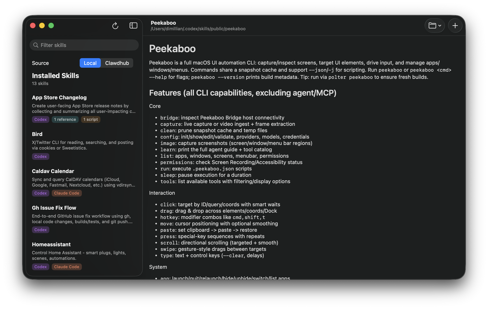

# Skills Manager



[English](README.en.md)

Skills Manager 是一款基于 SwiftPM 构建的 macOS SwiftUI 应用（不使用 Xcode 工程）。它用于管理 Codex 和 Claude Code 的本地技能，渲染每个 `SKILL.md`，并浏览 Clawdhub 上的远程技能。

本项目基于 [Dimillian/CodexSkillManager](https://github.com/Dimillian/CodexSkillManager) 的提交 [`3f2d809c`](https://github.com/Dimillian/CodexSkillManager/commit/3f2d809c19cd18f5b0d74997c3457760fd819035) 开始独立二次开发。原项目采用 MIT License；本项目保留原作者的版权和许可声明，详见 [LICENSE](LICENSE)。

### 功能

- 浏览 `~/.codex/skills`、`~/.codex/skills/public` 和 `~/.claude/skills` 中的本地技能
- 使用 Markdown 渲染 `SKILL.md`，并预览行内引用
- 从文件夹或 zip 文件导入技能
- 从侧边栏删除技能
- 搜索 Clawdhub 技能并浏览最新发布内容
- 将远程技能下载到 Codex 和/或 Claude Code
- 在详情页显示 Clawdhub 作者信息
- 使用视觉标签显示已安装平台（Codex/Claude）和版本

### 环境要求

- 运行环境：macOS 15 及以上
- 开发环境：Swift 6.2 及以上、Xcode 26 及以上

### 构建与运行

```bash
swift build
swift run CodexSkillManager
```

### 打包本地应用

```bash
./Scripts/compile_and_run.sh
```

### 致谢

- Markdown 渲染：[swift-markdown-ui](https://github.com/gonzalezreal/swift-markdown-ui)
- 远程技能目录：[Clawdhub](https://clawdhub.com)
