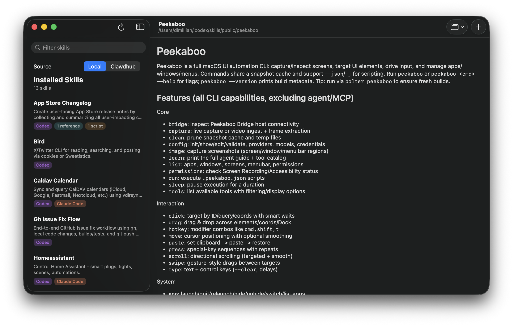

# Skills Manager



[English](README.en.md)

Skills Manager 是一款基于 SwiftPM 构建的 macOS SwiftUI 应用。它将多个 AI CLI 工具使用的 Skills 统一纳入单一事实来源（SSOT），并提供导入、分发、启用/停用、备份与恢复。仓库中的 Xcode 工程仅用于 Apple 原生 UI 测试宿主，不是产品工程。

本项目基于 [Dimillian/CodexSkillManager](https://github.com/Dimillian/CodexSkillManager) 的提交 [`3f2d809c`](https://github.com/Dimillian/CodexSkillManager/commit/3f2d809c19cd18f5b0d74997c3457760fd819035) 开始独立二次开发。原项目采用 MIT License；本项目保留原作者的版权和许可声明，详见 [LICENSE](LICENSE)。

### 功能

- 将受管理的 Skills 统一存放在 `~/.SkillsManager/skills/`
- 扫描并导入 Codex、Claude Code、OpenCode 和 GitHub Copilot 目录中尚未管理的 Skill
- 默认通过 Symlink 分发到兼容的 `~/.agents/skills/`，也可使用 Copy 或只对指定 Agent 启用；Copy 被外部修改时可安全保留为独立 Fork
- 按 Agent 启用或停用 Skill，避免全局目录和专属目录出现同名副本
- 删除 Skill 本体前自动备份，并支持查看和恢复备份
- 检查单个或批量 Skill 的远程更新，并逐项展示更新结果和失败状态
- 审计 SSOT、分发目录和历史 Skill，预览后执行一致性修复或迁移
- 使用 Markdown 渲染 `SKILL.md`，并预览行内引用
- 从文件夹或 ZIP 文件导入 Skill
- 在统一列表中组合状态、来源和 Agent 筛选，并在当前选择被筛掉时安全清空详情
- 一次选择多个待接管 Skill，逐项预览、导入并读取成功或失败结果
- 预览多 Skill ZIP，选择子集后确认导入，取消时保持 SSOT、数据库和分发状态不变
- 登记固定 GitHub 仓库、发现候选并在 immutable revision/subpath 预览后安装
- 搜索 ClawHub 技能并浏览最新发布内容
- 在详情页显示 ClawHub 作者信息
- 通过 skills.sh 搜索索引发现 GitHub Skill，并在解析出唯一安全来源后安装

skills.sh 集成不可用时不会影响本地 Skill、ClawHub、GitHub 仓库或其他已管理功能。

### 托管库启动故障排查

如果托管库无法启动，请在应用横幅中打开“查看诊断…”，按首个阻塞诊断的恢复建议处理后重试。未知条目、权限问题或锁竞争需要先修复对应条目/进程；不要直接删除整个 `~/.SkillsManager`。

### 界面语言

应用原生支持简体中文（`zh-Hans`）和英文（`en`）。简体中文是开发语言、默认语言和缺失翻译时的回退语言；Skill 内容、路径、Provider 数据、日志和持久化值保持原文不变。应用遵循 macOS 的 App 语言设置，不提供应用内语言切换器：在“系统设置 → 通用 → 语言与地区 → 应用程序”中为 Skills Manager 选择语言后重新打开应用即可。

### 环境要求

- 运行环境：macOS 15 及以上
- 开发环境：Swift 6.2 及以上、Xcode 26 及以上

### 构建与运行

```bash
swift build
swift run SkillsManager
```

### 打包本地应用

```bash
./Scripts/compile_and_run.sh
```

### 致谢

- Markdown 渲染：[swift-markdown-ui](https://github.com/gonzalezreal/swift-markdown-ui)
- 远程技能目录：[ClawHub](https://clawhub.ai/)
- 交互合同与归属参考：[CC Switch](THIRD_PARTY_NOTICES.md#cc-switch)
